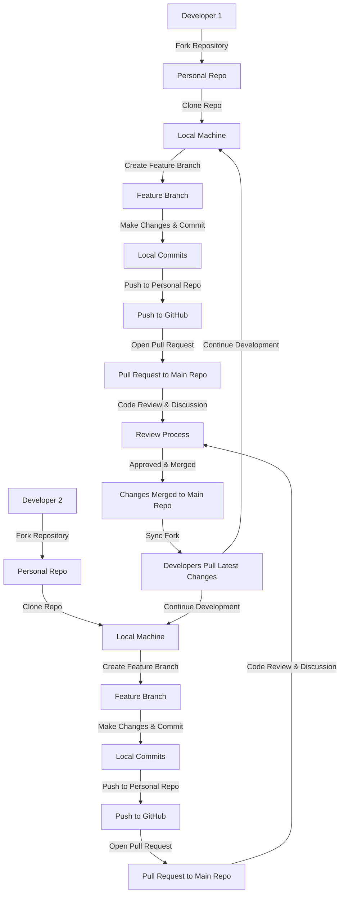

git - checkpoint, Version Control System, Linus Torvalds, software the runs locally on the machine

github - service that hosts git repositories in the cloud and makes it easier to collaborate

bash - command line interface, unix-based, default shell for linux and mac

git bash - a tool that emulates a Bash on a windows machine

command prompt - the default shell for windows

setting up name and email

```bash
git config user.name
git config --global user.name "Son Dao"
git config user.email
git config --global user.email "sondao@gmail.com"
```

#### Basic unix commands

```bash
ls
ls -a
pwd
cd directory
cd ..
touch purple.txt
mkdir colors
rm purple.txt
rm -rf colors
```

#### Adding & committing

```bash
git init
git status
git log
```

always run git status before you initialize so you don't end with a git repo nested in another git repo. Delete the .git folder if you want to remove the nested repo

working directory > git add > staging area > git commit > repository

`git add` allows you to selectively which changes to include in the next commit. You don't necessary have to include all the files with `git add .`

#### Commits in detail

atomic commit - a commit should encompass a single feature, change, or fix.

describe your changes in imperative mood, -m 'make abc add xyz', use present tense

```bash
git log --pretty=oneline
git log --abbrev-commit
git log --oneline
```

amending commit

```bash
git commit -m 'some commit'
git add forgotten_file.txt
git commit --amend
```

#### Working with branches

branches - alternative timelines of a project

in 2020, github renamed the master branch to main

head - a pointer that refers to the 'current' location in the repo. It points to a particular branch reference.

```bash
git branch // show the current branches
git branch <branch-name> // create a new branch based upon the current HEAD
git switch <branch-name> // switch to the brand
git switch -c <branch-name> // create new branch and switch to new branch
git switch - // go to the last branch
```

combine `git add` and `git commit` into a single command using the `-a` option with `git commit`. This option automatically stages files that have been modified or deleted, but it does not include new (untracked) files.

```bash
git commit -a -m 'your commit message'
```

historically, we used `git checkout <branch-name>` to switch branches, but it also does additional things.

switching branches with unstaged changes? the behavior of unstaged changes when switching branches depends on whether the changes conflict with the state of the target branch. Git provides mechanisms like stashing and committing to help manage these changes safely.

#### Undoing changes & time traveling

git checkout - git Swiss army knife

Normally, HEAD points to the latest commit on the current branch. When you use `git checkout` to switch to an earlier commit, you're essentially moving the HEAD pointer to that specific commit.

```bash
git checkout commit-hash
git checkout branch-name
git chechout HEAD~1 // checkout the previous commit
git checkout HEAD <file-name> // revert the file to the last commit/HEAD
git chekout -- <file-name> // same as above
```

git restore - undoing operations

```bash
git restore <file-name> // revert/restore the file to the last commit/HEAD
git restore --source HEAD~1 <file-name> // revert a file to a specific commit
git restore --staged <file-name> // un-staged a file
```

git reset - reset a repo back to a particular commit

```bash
git reset <commit-hash> // revert back to some commit but keep changes in working directory, use this in conjunction with git switch -c <new-branch> to move the changes to another branch.
git reset --hard <commit-harsh> // undo both commits and changes
```

git revert - similar to git reset but create brand new commit which reverse/undo the changes

```bash
git revert <commit-hash>
```

git revert - use this command when collaborating

git reset - use this command when working by yourself

#### Github the basics

```bash
git clone <url>
```

```bash
git remote
git remote -v // view existing remote repo
git remote add <name> <url> // add a new remote
git remote rename <old> <new>
git remote remove <name>
git push <remote> <branch>
git push <remote> <local-branch>:<remote-branch> // pushing a local branch to a remote branch with different name
git push -u origin master // set up the upstream, this allows us to use git push without classifying local and remote branches
git clone <url>
```

#### Fetching & Pulling

remote tracking branch - a reference to the state of the master branch on the remote, it can't move itself, it's like a bookmark pointing to the last known commit on the main branch on origin.

```bash
<remote>/<branch> origin/master
git remote -r // remote tracking branch
git checkout origin/master
// working with remote branches
git switch <remote branch name> // create a local branch from the remote branch
```

centralized workflow - everyone works on the main branch

feature branches workflow - working on features brand instead of the main brand

pull request - requesting a brand to be merged into another brand

fork & clone workflow - every dev has their own repo in addition to the main repo, commonly used in large open-source projects



#### Rebase

rebase - an alternative to merge, a clean up tool. Rebase a feature brand means moving the entire feature brand so that it BEGINS at the tip of the master branch.

```bash
git switch feature
git rebase master
```

never rebase commits that have been shared with others. If you have already pushed the commits, do not rebase them unless you are positive no one else is using those commits

```bash
git rebase -i HEAD~4 //interactive mode
```

#### Git Tags

git tags - pointers that refer to particular points in Git history. They are often used to mark version releases.

lightweight tags - name/label that points to a particular commit.

annotated tags - store extra meta data include author's name and email, etc.

```bash
git tag // list tag
git tag -l "*beta*" // filter
```

#### Good to know topics

Git behind the scenes - hashing & objects

Git reflogs

Writing Custom git aliases
